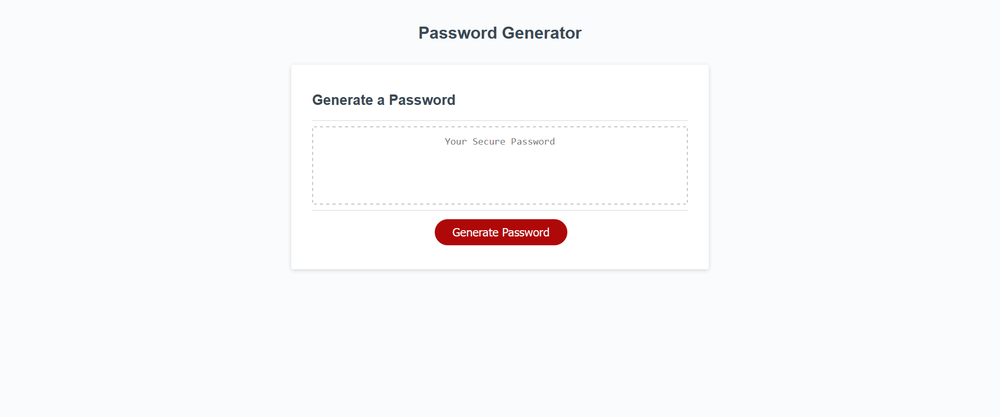

<h1>Description</h1>

This javascript application was created to allow the user to generate a password.
The user is able to set the length of the password and can optionally include lowercase, uppercase, special characters, or numbers in their password.

<h1>Usage</h1>
Steps to use my password generator:
1. Click generate password
2. Enter length of the password
3. Answer if you would like to include lowercase, uppercase, special characters, or numbers.

<h1>Application</h1>
https://neongreen64.github.io/challenge3/

<h1>License</h1>

Please refer to the LICENSE in the repo.

